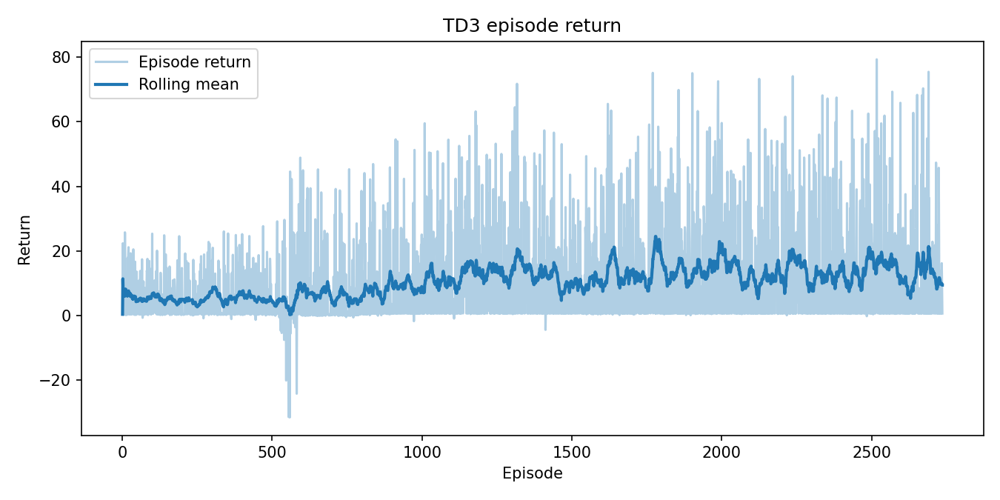
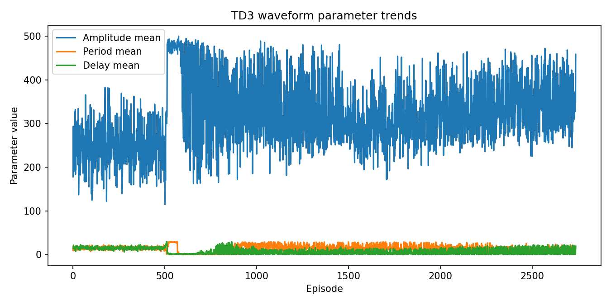
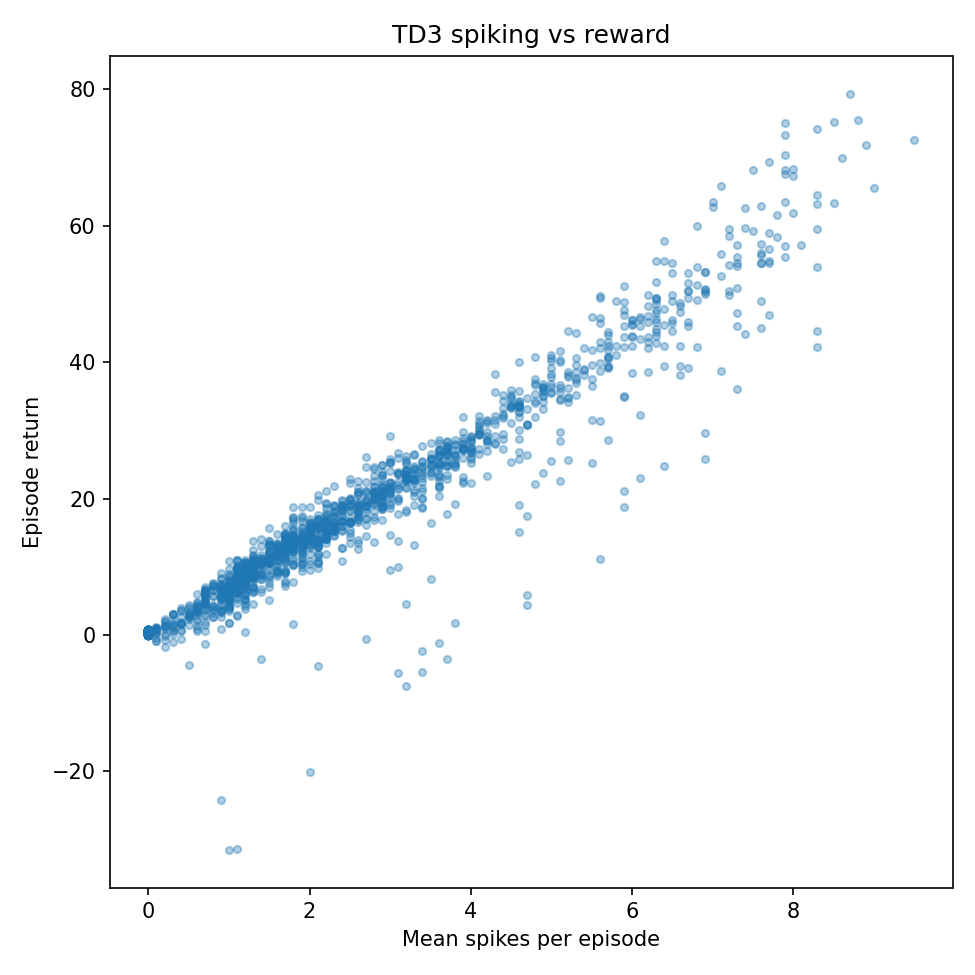
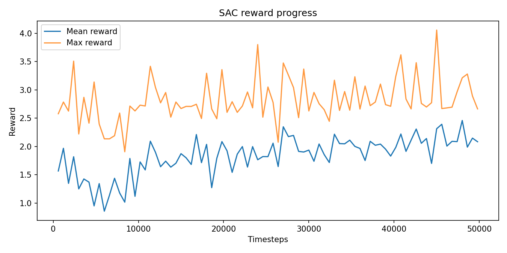
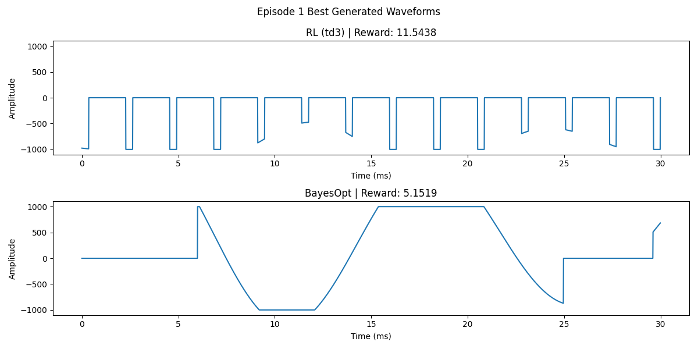

# RL Waveform Optimization With NEURON

This project trains reinforcement-learning agents to optimize neural stimulation waveforms in the NEURON simulator. It combines a Gymnasium environment, Stable-Baselines3 agents, custom waveform parameterizations, reward criteria, and NEURON cell/mechanism assets.

## Project Layout

```text
src/simulation/
  agents/        Stable-Baselines3 agent wrappers
  criteria/      Reward criteria such as minimum energy and selectivity
  fields/        Electric-field models
  neuron/        NEURON bridge code and simulator assets
  training/      Training and evaluation entry points
  waveforms/     Waveform parameterizations
  environment.py Gymnasium environment
  paths.py       Shared filesystem paths
docs/            Project and NEURON asset documentation
docs/images/     Static figures for the README (not generated training plots)
scripts/         Setup and experiment helper scripts
plots/           Generated training/evaluation plots
weights/         Generated model checkpoints
```

See `docs/project-structure.md` for more detail.

## Example Results

These figures are checked in under `docs/images/` so the README can show them while the entire `plots/` directory stays gitignored for generated training output. They were produced from representative `debug_metrics.csv` runs that live under `plots/` locally.









### RL vs Bayesian optimization

This figure comes from `uv run simulation-compare` (TD3 on Fourier waveforms, minimum-energy criterion, two episodes, four steps per episode, seed 42). It shows the best waveforms from episode 1 for RL versus Ax BayesOpt.



## Setup

This project uses `uv` as the default package manager. Create the environment and install the package from the lockfile:

```bash
uv sync
```

Compile NEURON mechanisms from the project root:

```bash
uv run nrnivmodl src/simulation/neuron/assets/mechanisms
```

The helper script runs both steps:

```bash
bash scripts/init_setup_run_once.sh
```

## Training

After installation, train an agent with:

```bash
uv run simulation-train --model_type recurrentppo --waveform_type fourier --criterion_type min_energy
```

You can also run the module directly from the project root:

```bash
uv run python -m simulation.training.train
```

Useful options include `--model_type`, `--waveform_type`, `--criterion_type`, `--lr`, `--timesteps`, `--max_amplitude`, and `--normalize_obs`.

Training writes plots to `plots/` and checkpoints to `weights/`.

## Evaluation

Compare a trained RL checkpoint against the Bayesian-optimization baseline:

```bash
uv run simulation-compare --model_type ppo --waveform_type fourier --criterion_type min_energy
```

If the default checkpoint name is not present, pass `--model_path` explicitly. Checkpoints trained before the observation vector included best-so-far waveform parameters and reward are still supported: the comparison script projects observations to the saved policy size when that legacy layout matches.

To reproduce the BayesOpt figure above (after `uv sync` and NEURON setup):

```bash
uv run simulation-compare --model_type td3 --model_path weights/td3_fourier_min_energy_opt.zip \
  --waveform_type fourier --criterion_type min_energy --episodes 2 --max_actions 4 --seed 42
```

Plots are written under `plots/compare_vs_bayesopt_baseline/<timestamp>_.../`; copy files from `episode_waveforms/` (or elsewhere in that run folder) into `docs/images/` if you want them in the README.

## NEURON Assets

HOC files, cell definitions, and MOD mechanisms live under `src/simulation/neuron/assets/`. Runtime code resolves these paths through `simulation.paths`, so commands do not depend on the current working directory. See `docs/neuron-assets.md` for compilation and save-state details.

## Development Notes

Add new waveform classes under `src/simulation/waveforms/`, criteria under `src/simulation/criteria/`, and agent wrappers under `src/simulation/agents/`. Keep exploratory scripts in `src/simulation/experiments/` unless they become reusable package code.

`setuptools` is pinned below version 81 because newer versions deprecated behavior that the current NEURON toolchain still depends on.

Generated outputs should stay out of commits. The main generated directories are `plots/`, `weights/`, `TISimResults/`, `arm64/`, and `x86_64/`.

## Citation

If you use the original cell-specific temporal-interference simulation assets, cite the work listed in `Citation.cff`.
